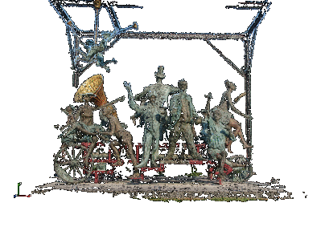

### EMVS (Efficient Large Scale Multi-View Stereo for Ultra High Resolution)

<p align="center">
 
</p>

## About

 This is OpenCV implementation of EMVS dense stereo matching described in [1] and [2].

 * Original project page: http://cvlab.epfl.ch/research/surface/emvs/
 * Implementation here follows some of authors original ideas, but not fully.

## Progress

```10-Jan-2016```
 * Requires OpenCV with PR: https://github.com/Itseez/opencv_contrib/pull/503

## Authors

 Alphabetical order:

 * **Balint Cristian** ```<cristian dot balint at gmail dot com>```
 * **Nghia Ho** ```<nghiaho12 at yahoo dot com> http://nghiaho.com```


## Citation
```
[1] E. Tola and C. Strecha and P. Fua
"Efficient Large Scale Multi-View Stereo for Ultra High Resolution Image Sets"
Machine Vision and Applications
```
```
[2] Tola, Engin
"A Closed-Form Solution for the Uniform Sampling of the Epipolar Line via Non-Uniform
Depth Sampling"
EPFL-REPORT-150161
```
